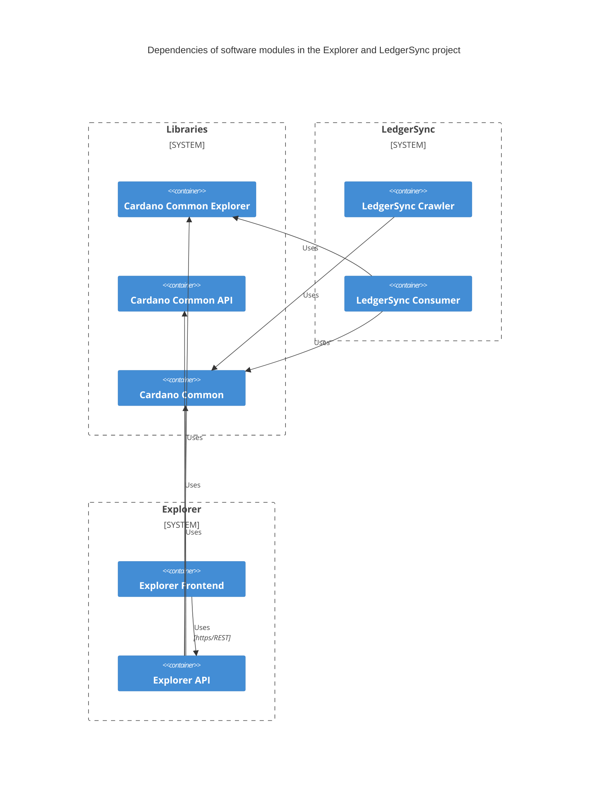

# cf-cardano-java-artifacts

## modules and dependencies

```mermaid
  C4Component
    title Dependencies of software modules in the Explorer and LedgerSync project

    System_Boundary(libs, "Libraries") {
      Container(cce, "Cardano Common Explorer", $link="https://github.com/cardano-foundation/cf-java-cardano-common-explorer")
      Container(cca, "Cardano Common API", $link="https://github.com/cardano-foundation/cf-java-cardano-common-api")
      Container(cco, "Cardano Common", $link="https://github.com/cardano-foundation/https://github.com/cardano-foundation/cf-java-cardano-common")
    }
    System_Boundary(ls, "LedgerSync") {
      Container(lscrawl, "LedgerSync Crawler", $link="https://github.com/cardano-foundation/cf-ledger-crawler")
      Container(lsconsume, "LedgerSync Consumer", $link="https://github.com/cardano-foundation/cf-ledger-consumer")
    }
    System_Boundary(explorer, "Explorer") {
      Container(web, "Explorer Frontend", $link="https://github.com/cardano-foundation/cf-explorer-frontend")
      Container(api, "Explorer API", $link="https://github.com/cardano-foundation/cf-explorer-api")
    }

    Rel(lscrawl, cco, "Uses", "")
    Rel(lsconsume, cco, "Uses", "")
    Rel(lsconsume, cce, "Uses", "")
    Rel(api, cco, "Uses", "")
    Rel(api, cce, "Uses", "")
    Rel(api, cca, "Uses", "")
    Rel(web, api, "Uses", "https/REST")
```
