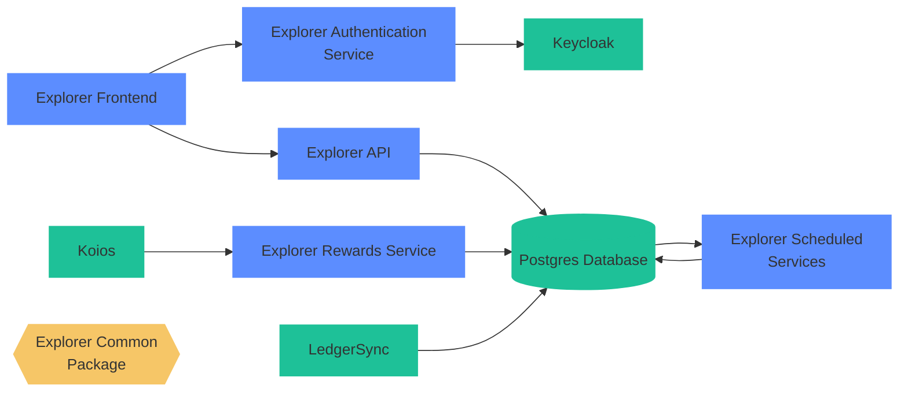

# Cardano Foundation Explorer Deployment

This project contains manifests and scripts to bootstrap and deploy the Cardano Foundation Explorer project and all its
dependencies.



### Tested Configuration

| Repository                   | Version |
|------------------------------|---------|
| cf-ledger-crawler            | 0.5.0   |
| cf-ledger-consumer           | 0.5.0   |
| cf-ledger-consumer-schedules | 0.2.19  |
| cf-explorer-api              | 0.5.0   |
| cf-explorer-rewards-api      | 0.1.7   |
| cf-explorer-authentication   | 0.1.15  |
| cf-explorer-frontend         | 0.5.3   |

## Continuous Deployment

[ArgoCD](https://argo-cd.readthedocs.io/en/stable/) ís the Continuous Deployment system of choice for deploying the applications
that compose the Explorer system and all its dependencies.

## Bootstrap

Bootstrapping a cluster is the process of deploying artifacts for the very first time. ArgoCD itself needs to be deployed the first time
and then, in turn ArgoCD will deploy all the components under its control in a [GitOps](https://about.gitlab.com/topics/gitops/) fashion.

An [Application](https://argo-cd.readthedocs.io/en/stable/core_concepts/) In ArgoCD is a:
> A group of Kubernetes resources as defined by a manifest. This is a Custom Resource Definition (CRD).

Some examples could be: 
1. Microservices and all their resources (workers, network resources, DNS definitions, scaling policies)
2. Databases
3. System / Administration services (metric server etc)

In order to bootstrap the cluster is used the technique of [App of Apps](https://argo-cd.readthedocs.io/en/stable/operator-manual/cluster-bootstrapping/).

For more info, check the [README.md](argocd-bootstrap/README.md)

# Helm Repositories

Full list of helm repositories to add

```bash 
helm repo add argo-cd https://argoproj.github.io/argo-helm
helm repo add sealed-secrets https://bitnami-labs.github.io/sealed-secrets
helm repo add bitnami https://charts.bitnami.com/bitnami
helm repo add traefik https://helm.traefik.io/traefik
helm repo add prometheus-community https://prometheus-community.github.io/helm-charts
helm repo add elastic https://helm.elastic.co
```

## Embedded Services

### Kibana

Kibana credentials are:

* user: elastic
* password: `kubectl get secret -n elastic-stack quickstart-es-elastic-user -o json | jq -r .data.elastic`
